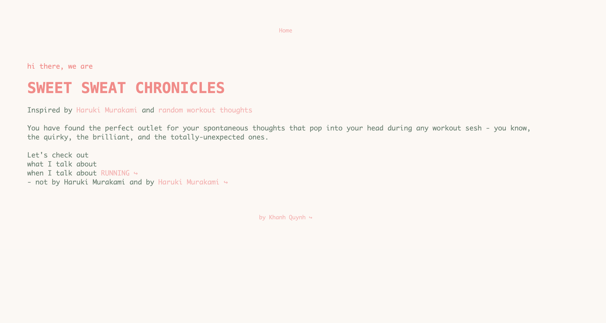

# Sweet Sweat Chronicles
### Built with Flask and Pymongo

- For the past few weeks, I have been munging 2 thing: data and Haruki Murakami's memoir *"What I Talk About When I Talk About Running"*. Inspired by the memoir and by how chaotic my mind is during any workout session, I'm introducing **Sweet Sweat Chronicles** - a placec for people to have fun, be comfortable, or vulnerable with the thoughts that show up uninvited when they head out for a run.
- Website: https://i6.cims.nyu.edu/~qkn201/7-web-app-khanh-quynh/flask.cgi/

## Home Page

